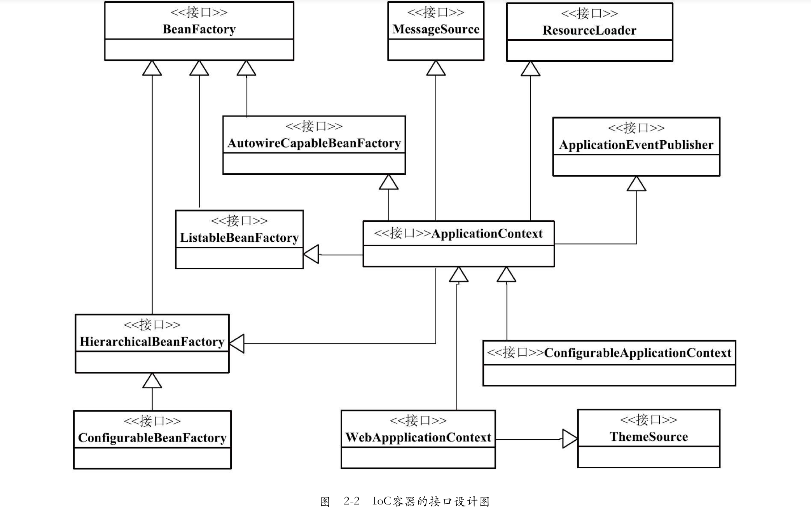
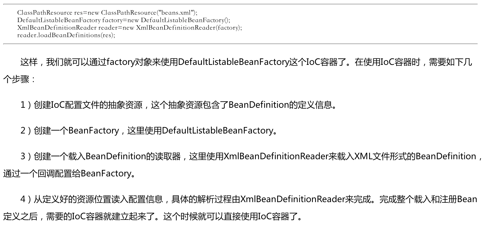
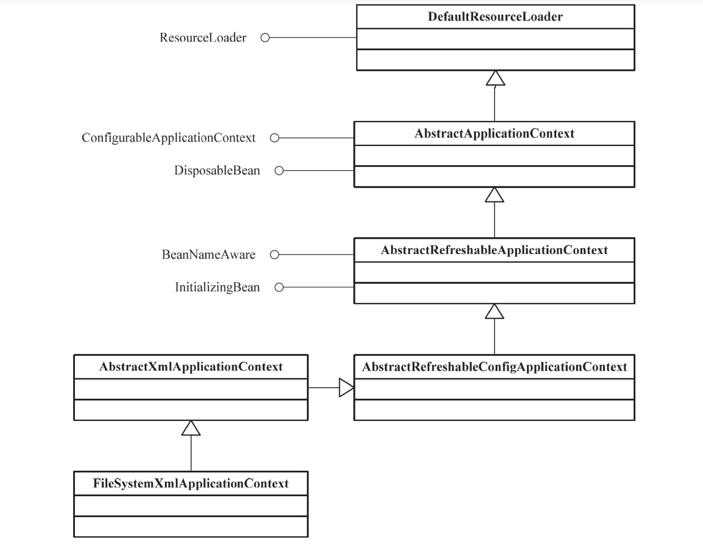
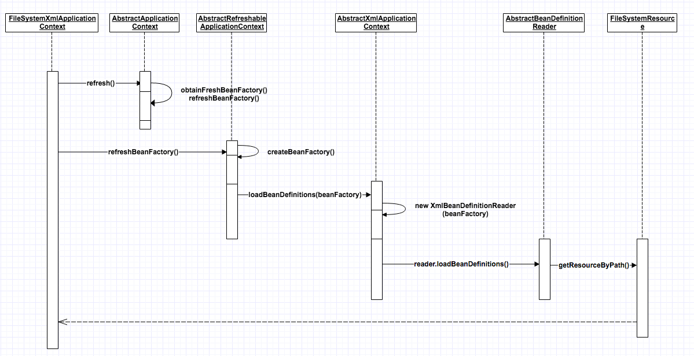
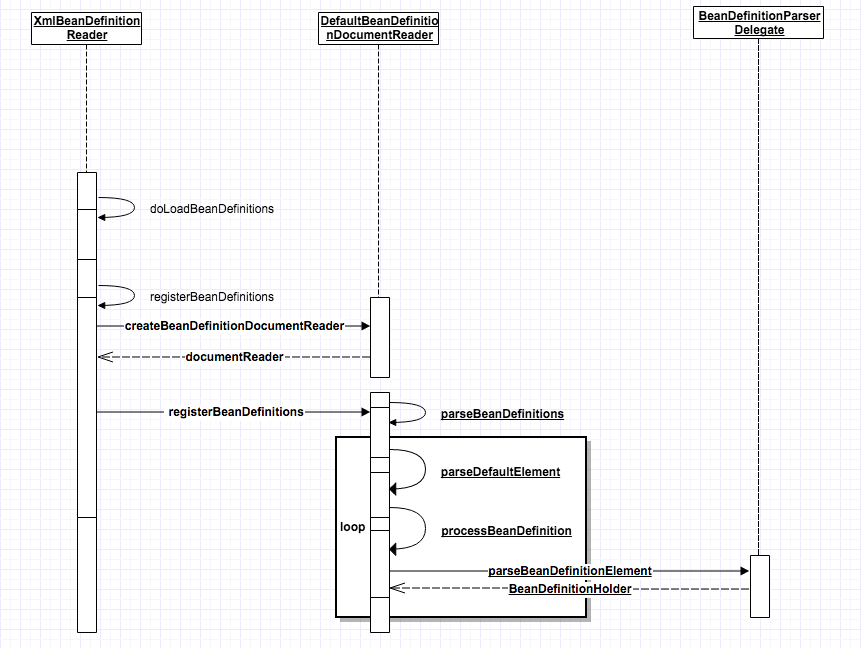

###Spring IoC 容器设计
                   
1.	BeanFactory

	
	
	BeanFactory接口定义了基本的IoC容器规范，并且提供了IOC容器所应遵循的最基本的服务契约，这些几口定勾画出了IOC的基本轮廓.包括getBean这样的基本方法来从容器中获取bean

	IoC容器建立的基本步骤：
	

2.	ApplicationContext

	ApplicationContext是一个高级形态的IoC容器，其在BeanFactory的基础上添加了附加功能

###IoC容器的初始化过程

IoC容器的初始化是由refresh()方法来启动的，包括BeanDefinition的Resource定位、载入和注册三个基本过程。
在这个过程中，一般不包括Bean依赖注入的实现。在Spring IoC的设计中，Bean定义的载入和依赖注入是两个独立的过程。
依赖注入一般发生在第一次getBean向容器获取Bean实例的时候。但也可以预设实例化配置lazyinit。

1.	Resource定位

	Resource定位指的是BeanDefinition的资源定位，它由ResourceLoader通过统一的Resource接口完成，这个Resource对各种形式的BeanDefinition的使用都提供了统一接口。比如在文件系统中的BeanFactory定义信息可以使用FileSystemResource来抽象；在类路径中的Bean定义信息可以使用ClassPathResource

	以FileSystemApplicationContext为例，分析Resource定位过程：
	

	

2.	BeanDefinition载入和解析

	这个过程是把用户定义好的Bean表示成IoC容器内部的数据结构，而这个容器内部的数据结构就是BeanDefinition，通过这个BeanDefinition定义的数据结构，使IoC容器能方便的对Bean进行管理。

	

		public int registerBeanDefinitions(Document doc, Resource resource) throws BeanDefinitionStoreException {
			BeanDefinitionDocumentReader documentReader = createBeanDefinitionDocumentReader();
			documentReader.setEnvironment(this.getEnvironment());
			int countBefore = getRegistry().getBeanDefinitionCount();
			documentReader.registerBeanDefinitions(doc, createReaderContext(resource));
			return getRegistry().getBeanDefinitionCount() - countBefore;
		}

	registerBeanDefinitions是对BeanDefinition解析的详细过程，会使用到Spring的Bean配置规则并转化为容器的内部数据结构。BeanDefinition的载入分为两个部分，首先通过调用XML的解析器得到document对象，但这些document对象并没有按照Spring的Bean规则进行解析。在完成通用的XML解析后，才是按照Spring的Bean规则进行解析的地方，这个按照Spring的Bean规则进行解析的过程在documentReader中实现：DefaultBeanDefinitionDocumentReader，然后在完成BeanDefinition的处理，处理结果由BeanDefinitionHolder来持有.BeanDefinitionHolder的生成是通过对Document文档树的内容解析来完成的，可以看到这个解析过程是由BeanDefinitionParserDelegate实现的。

	BeanDefinitionParserDelegate的 parseBeanDefinitionElement最终会处理每一个送来的Spring的Bean的doc对象，包括id，name等各种属性，解析完成后，会把解析结果放到BeanDefinition中并设置到BeanDefinitionHolder中。

3.	向IoC容器注册BeanDefinition

   在IoC内部将BeanDefinition注入到HashMap中

